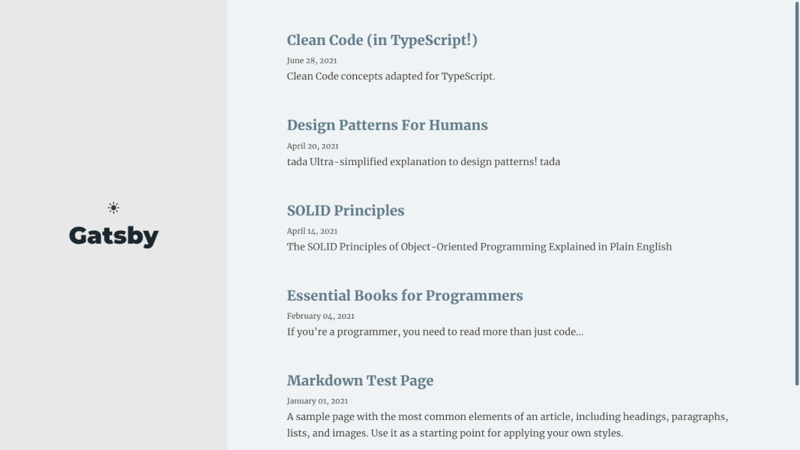

# Gatsby Blog

A simple blog powered by Gatsby and Markdown

<h2 align="center">
  
  <br>
</h2>

- Markdown based blog with syntax-highlighting
- Responsive templates. Looking good on any viewport.
- Fixed sidebar (or navbar in smaller devices) to provide a good navigation experience while reading.
- Light/Dark mode.
- Pagination

See a [demo](https://armanabkar.github.io/gatsby-blog/) hosted on GitHub pages.

## Getting Started

```
gatsby new my-blog https://github.com/armanabkar/gatsby-blog
cd my-blog
gatsby develop
```

Check out your awesome blog at `http://localhost:8000` and Cheers!

